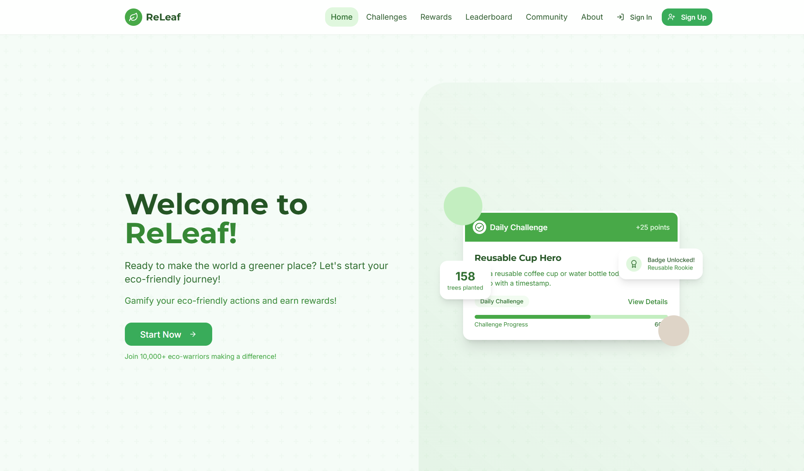
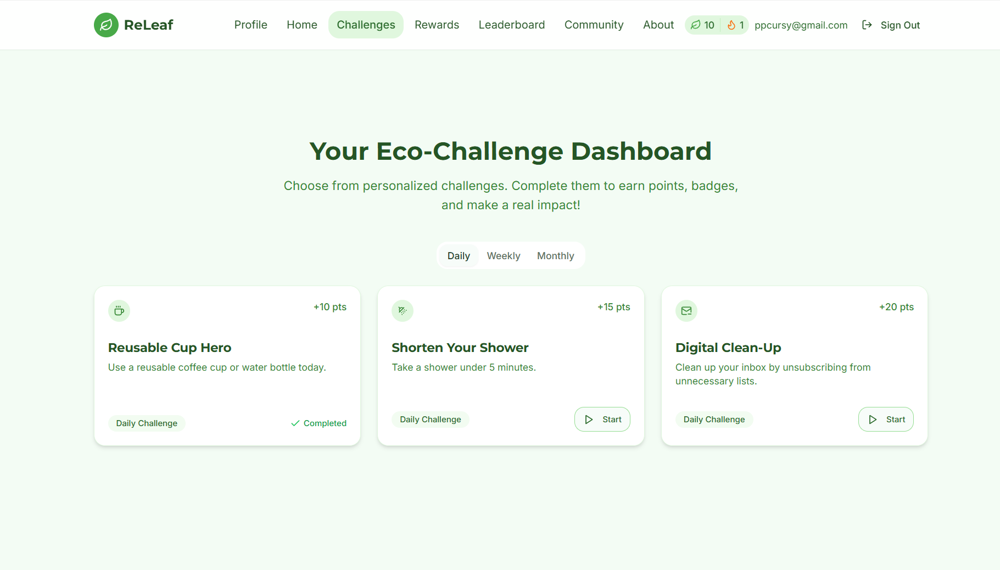
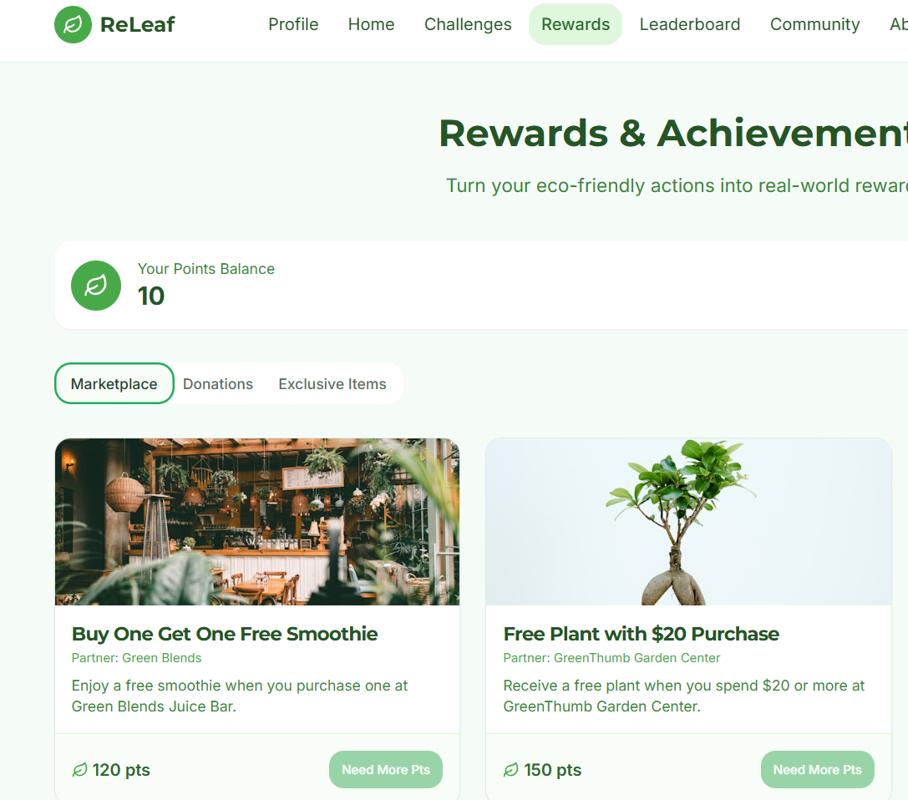
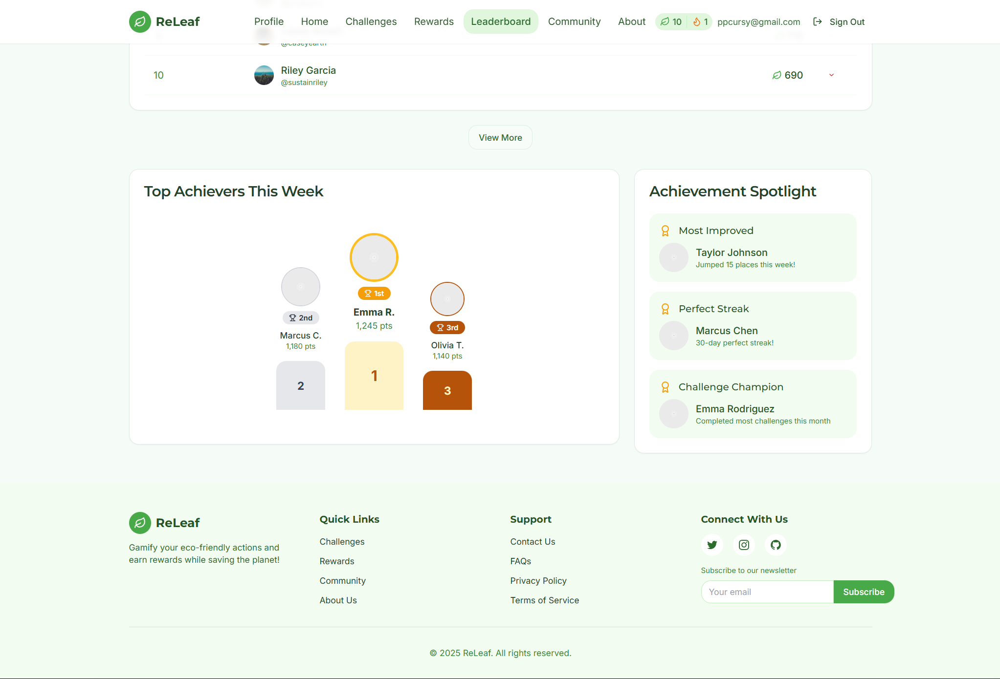
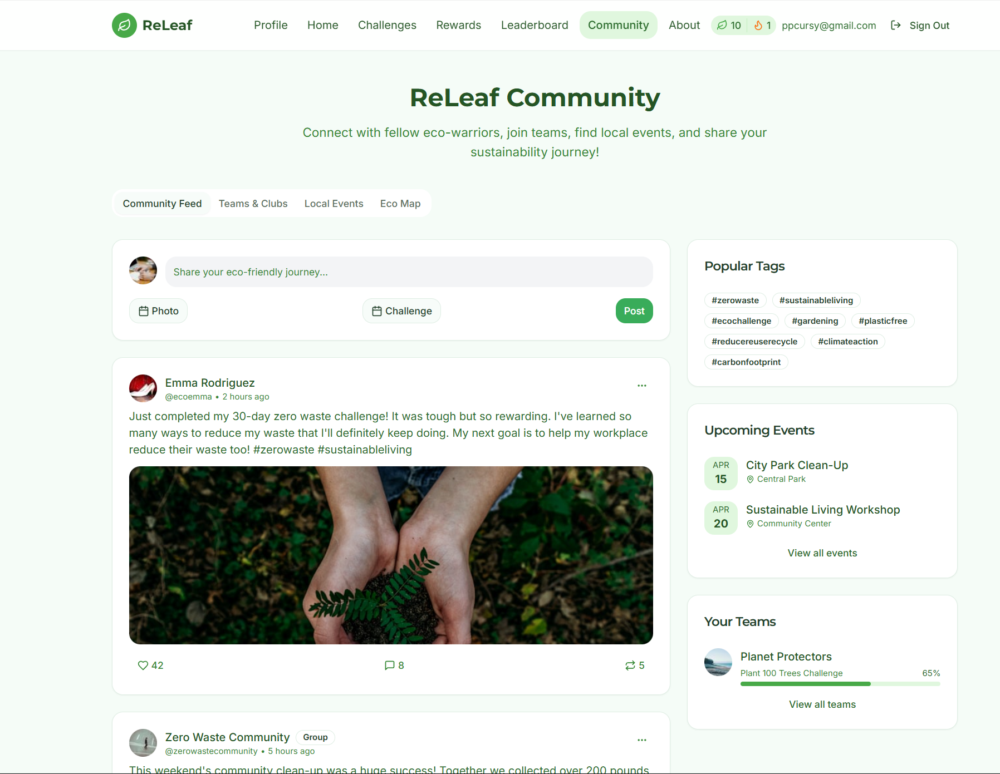
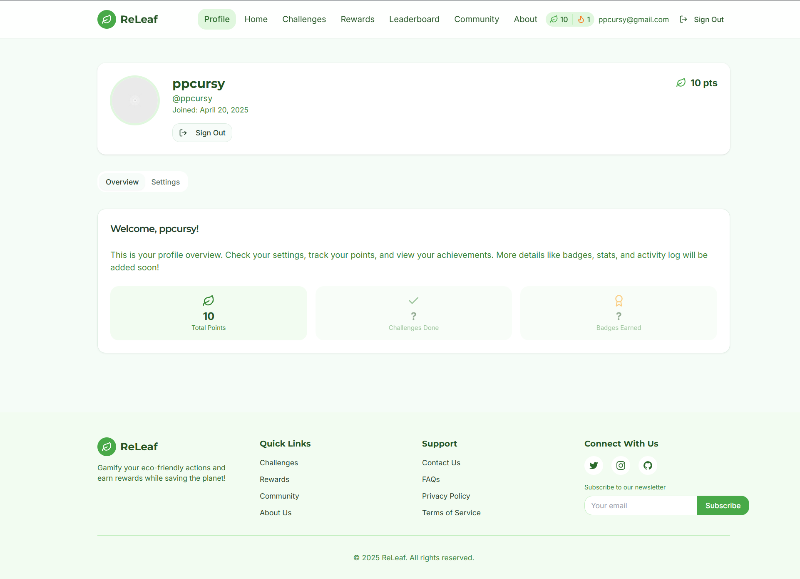
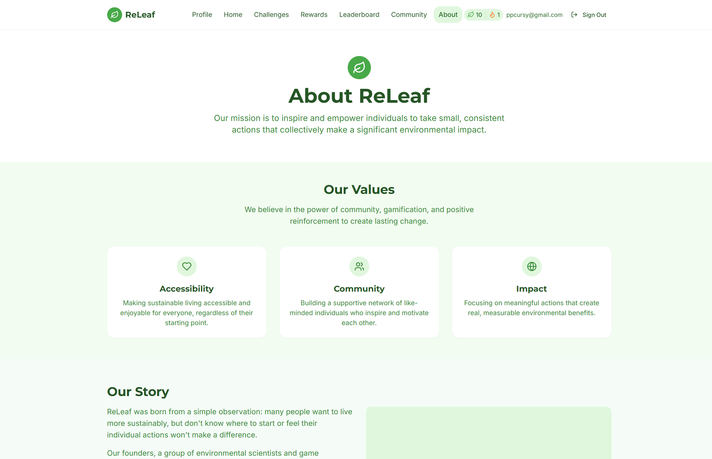

# ReLeaf: Gamified Sustainability

ReLeaf is an innovative app that transforms sustainability into an engaging game. Its main goal is to bridge the gap between environmental awareness and action by making eco-friendly habits fun, social, and rewarding.

[](https://app.netlify.com/sites/releafy/deploys)

[Click here to visit the live site](https://releafy.netlify.app/)

## Key Features

*   **User Authentication:** Secure sign-up, sign-in, sign-out, and password recovery.
*   **Login Streaks:** Tracks consecutive daily logins with visual badges for milestones (3, 7, 14, 30 days).
*   **Points System:** Displays user points (earned through future challenge completions).
*   **Profile Management:** View profile details (username, join date) and update basic information (name, age).
*   **Rewards:** Browse available rewards (redemption logic pending).
*   **Static Pages:** About, Community, Leaderboard placeholders.
*   **Gamified Challenges:** (Challenge viewing/details implemented, completion logic pending).
*   **Responsive Design:** Adapts to different screen sizes.

## Tech Stack

*   **Framework:** React (v18 Functional Components + Hooks) with Vite
*   **Language:** TypeScript
*   **Routing:** React Router (v6)
*   **Backend / API:** Supabase (Authentication, Database, Functions)
*   **State Management:** React Context API (`AuthContext`)
*   **UI Library:** shadcn/ui (Radix UI + Tailwind CSS)
*   **Styling:** Tailwind CSS
*   **Form Handling:** React Hook Form (v7)
*   **Schema Validation:** Zod
*   **Icons:** Lucide React
*   **Package Manager:** Bun

## Getting Started

### Prerequisites

*   Node.js (v18 or higher recommended)
*   Bun (v1.1 or higher recommended)
*   A Supabase account and project.

### Setup

1.  **Clone the repository:**
    ```bash
    git clone https://github.com/mist-ic/ReLeaf.git
    cd ReLeaf
    ```

2.  **Install dependencies using Bun:**
    ```bash
    bun install
    ```

3.  **Set up environment variables:**
    *   Create a Supabase project at [supabase.com](https://supabase.com/).
    *   Navigate to your project's **Settings > API**.
    *   Copy the **Project URL** and the **anon public key**.
    *   Rename the `.env.example` file in the project root to `.env`.
    *   Paste your Project URL and anon key into the `.env` file:
        ```dotenv
        VITE_SUPABASE_URL=YOUR_PROJECT_URL
        VITE_SUPABASE_ANON_KEY=YOUR_ANON_PUBLIC_KEY
        ```

4.  **Run the Supabase database migrations (Optional but recommended for local development):**
    *   If you want the database functions (`update_login_streak`) and triggers (`handle_new_user`) locally, you can copy the SQL commands from the migrations applied via the assistant (check conversation history or Supabase dashboard SQL editor history) and run them in your Supabase project's SQL editor.

5.  **Run the development server:**
    ```bash
    bun run dev
    ```

6.  Open [http://localhost:5173](http://localhost:5173) (or the port specified in the output) in your browser.

## Screenshots

| Page        | Screenshot                                       |
| :---------- | :----------------------------------------------- |
| Homepage    |             |
| Challenges  |         |
| Rewards     |               |
| Leaderboard |       |
| Community   |           |
| Profile     |               |
| About       |                   |

## Deployment

This app is configured for deployment on Netlify using Bun. Pushing to the main branch should trigger automatic builds based on `netlify.toml`.

Ensure your Supabase environment variables (`VITE_SUPABASE_URL`, `VITE_SUPABASE_ANON_KEY`) are set in the Netlify site's **Build & deploy > Environment** settings.

## Learn More

*   [React Documentation](https://reactjs.org/)
*   [Vite Documentation](https://vitejs.dev/)
*   [Tailwind CSS Documentation](https://tailwindcss.com/docs)
*   [Shadcn/ui Documentation](https://ui.shadcn.com/)
*   [TanStack Query Documentation](https://tanstack.com/query/latest)
*   [React Router Documentation](https://reactrouter.com/)
